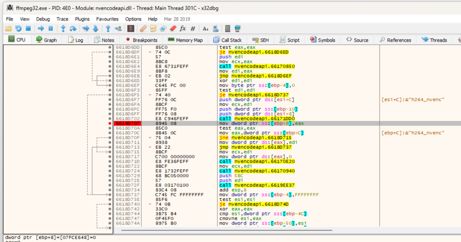
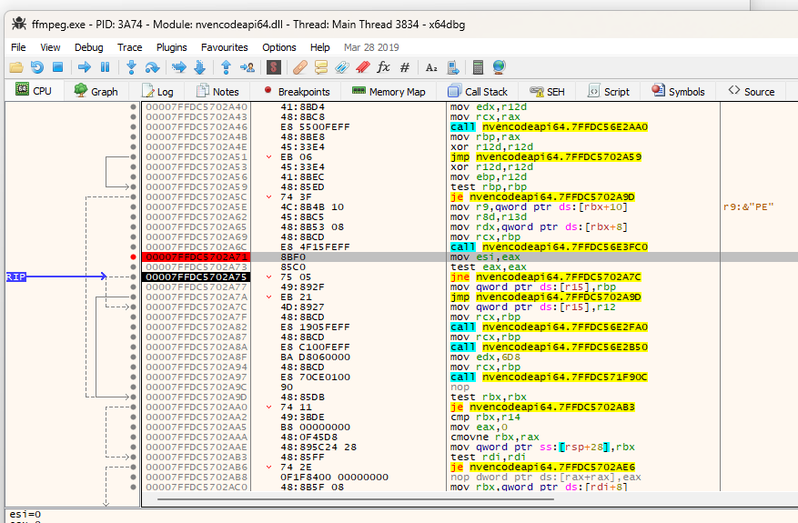
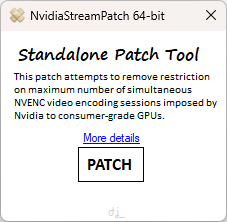
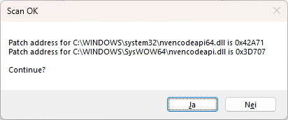
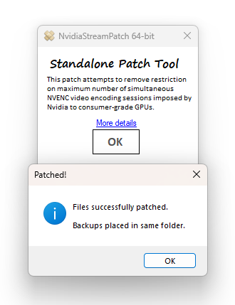
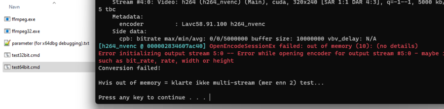
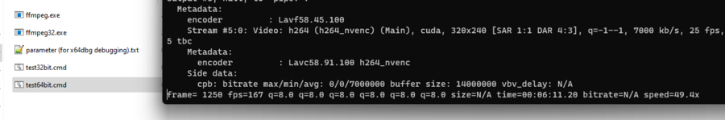

## ImageBaseSearcher

Et patcheverktøy for geforce drivere slik at PLEX/ffmpeg/mediaservere kan transkode mer enn 2 videostrømmer samtidig.  

Det er basert på https://github.com/keylase/nvidia-patch sitt arbeid som stadig legger ut offsets fra x64dbg for nyeste drivere.  

Jeg har forsøkt å automatisere denne prosessen i et enkelt verktøy som selv skanner etter mønsteret rundt disse bytsa, som jeg har testet OK på 536.99 og 537.13 men uten garanti for fremtidige.  

Dette etter at jeg fant ut hvor disse bytesene er fra egen reversering av driverne jeg foreløpig hadde på egen PC (536.99).  

 
 
 
 
Programmet tar backup av driverne før patching og gjør ingenting hvis det ikke finner offsets, som også må bekreftes før noe faktisk blir gjort, slik at man har en mulighet til å evt. sammenligne mot det som er publisert av keylase.  

 

 

 

Det er enkelt å teste patchen i etterkant med et ffmpeg skript, for både 32 og 64-bit driveren.  
 
**Før patching av nyeste 537.13:**  
 

**Etter patching:**  
 
 
 